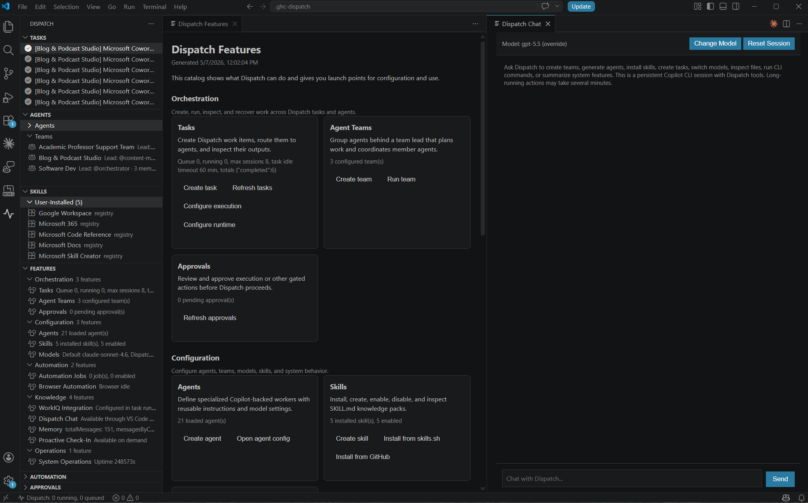
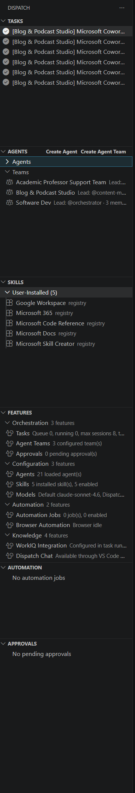
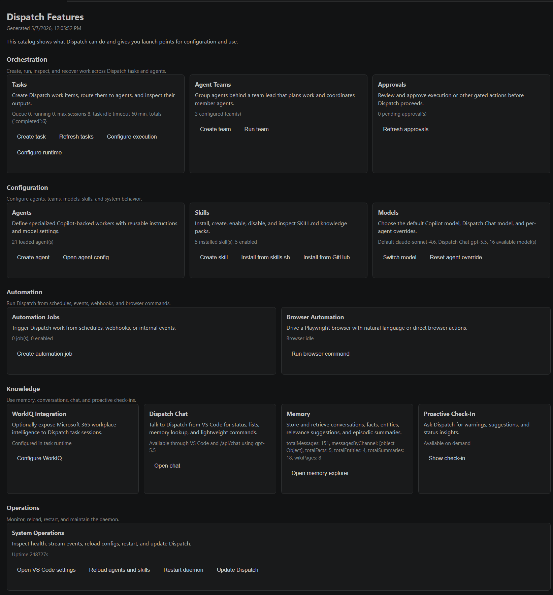

# GHC Dispatch — VS Code Extension Visual Walkthrough

A tour of the **GHC Dispatch** VS Code extension, screen by screen. Each section
has a short narrative followed by a media slot. Drop your screenshot or animated
GIF into the matching path under [`./walkthrough-media/`](./walkthrough-media/)
and the document will render it automatically — no other edits needed.

> 📁 **Where the media lives.** Every section references a file under
> `docs/walkthrough-media/`. Keep filenames lowercase-with-dashes and
> use `.png` for stills, `.gif` for short animations (≤ 10 s, ≤ 5 MB ideal),
> and `.mp4` only when you really need video. PNG/GIF render inline on
> GitHub; MP4 needs to be linked rather than embedded.

---

## Table of Contents

- [0. Before you start](#0-before-you-start)
- [1. First launch — auto-starting the daemon](#1-first-launch--auto-starting-the-daemon)
- [2. Activity bar & sidebar layout](#2-activity-bar--sidebar-layout)
- [3. Feature catalog landing page](#3-feature-catalog-landing-page)
- [4. Tasks view — list, statuses, status bar](#4-tasks-view--list-statuses-status-bar)
- [5. Creating a task (with optional Dry run)](#5-creating-a-task-with-optional-dry-run)
- [6. Task detail panel — events, artifacts, actions](#6-task-detail-panel--events-artifacts-actions)
- [7. Cancelling a task and adding a reason after the fact](#7-cancelling-a-task-and-adding-a-reason-after-the-fact)
- [8. Approvals view — approve / reject inline](#8-approvals-view--approve--reject-inline)
- [9. Agents view — inspect and create](#9-agents-view--inspect-and-create)
- [10. Teams — lead + members](#10-teams--lead--members)
- [11. Skills view — install, enable, disable](#11-skills-view--install-enable-disable)
- [12. Automation view — cron, webhook, event jobs](#12-automation-view--cron-webhook-event-jobs)
- [13. Dispatch Chat panel](#13-dispatch-chat-panel)
- [14. Switching models (default, chat, per-agent)](#14-switching-models-default-chat-per-agent)
- [15. Memory Explorer & Recall](#15-memory-explorer--recall)
- [16. Recovering paused tasks after a daemon restart](#16-recovering-paused-tasks-after-a-daemon-restart)
- [17. Settings reference](#17-settings-reference)
- [18. Daemon control — Reload, Restart, Update](#18-daemon-control--reload-restart-update)

---

## 0. Before you start

You'll need:

- The **dispatch CLI** on your `PATH` — install with `npm link` from the
  ghc-dispatch repo (see [HOWTO §3](../HOWTO.md#3-how-to-install-dispatch-globally)).
- The **GHC Dispatch** extension installed in VS Code (build a `.vsix` per
  [HOWTO §6](../HOWTO.md#6-how-to-install-the-vs-code-extension-from-source) and
  `code --install-extension dispatch-vscode-0.1.0.vsix`).
- A working **GitHub Copilot** subscription (or set
  `GHC_MOCK_COPILOT=1` to use the mock adapter).

Reload VS Code after installing the extension. Everything below assumes
`dispatch.autoStartDaemon` is left at its default of `true`.

---

## 1. First launch — auto-starting the daemon

The first time you click the Dispatch icon in the activity bar (or open any
Dispatch view), the extension health-checks
`http://localhost:7878/api/health`. If the daemon isn't responding, it spawns
`dispatch --start` in the background and shows a **"Starting Dispatch
daemon…"** progress notification while polling for readiness (up to 30s). Once
the daemon is up, the views populate automatically.

> If the spawn fails, check that `dispatch --version` works in your terminal,
> or set `dispatch.autoStartDaemon` to `false` and start the daemon yourself.

---

## 2. Activity bar & sidebar layout

The Dispatch icon adds a dedicated container with **six tree views**:

| View | What it shows |
|------|---------------|
| **Tasks** | All tasks grouped by status (running, queued, paused, pending, …) |
| **Agents** | Loaded agent definitions with their model |
| **Skills** | User-installed and system-created skills with enable/disable toggles |
| **Features** | The Dispatch feature catalog |
| **Automation** | Cron, webhook, and event-trigger jobs |
| **Approvals** | Pending approval requests |

A **status bar** item at the bottom-left shows live `running / queued` counts.

---

## 3. Feature catalog landing page

Clicking the Dispatch icon also opens the **Feature catalog** in the main
editor — a one-page overview of every Dispatch capability with live status,
links to the underlying API endpoints, and "Configure" / "Use" buttons for
each feature. Right-clicking a feature in the **Features** sidebar opens its
detail page.

---

## 4. Tasks view — list, statuses, status bar

The **Tasks** view groups tasks by status with colour-coded badges. Hover for
metadata; click to open the detail panel. The status bar at the bottom of VS
Code mirrors the live counts and clicks through to **Show Stats**.

---

## 5. Creating a task (with optional Dry run)

Click the **+** icon in the Tasks view title bar (or run `Dispatch: Create
Task` from the command palette) to open the Create Task webview. Fill in
title, description, agent (or team), priority, optional model override, repo,
and working directory.

The form has two checkboxes side-by-side at the bottom:

- **Pre-approved for execution** — skips the approval step and queues the task immediately.
- **Dry run (preview only)** — instead of creating, the form posts to
  `POST /api/tasks/preview` and shows the resolved agent handle, model
  (after agent / per-task overrides), priority, repo, and working directory in
  a panel above the form. Untick and click **Create** to actually create.

---

## 6. Task detail panel — events, artifacts, actions

Clicking a task in the Tasks view opens a webview with:

- Status badge, agent, priority, retries, working directory, repo
- Action buttons (Edit, Cancel, Delete, Retry, Enqueue, Refresh)
- **Plan files** and **Markdown documents** — clickable links open the file
  in an editor tab
- **Artifacts** — captured diffs, logs, and other outputs
- **Approvals** — inline Approve / Reject for any pending requests
- **Latest checkpoint** — JSON snapshot of the session's most recent state
- **Events** — full event timeline in chronological order

📷 _Suggested capture:_ a tall screenshot of a completed task showing the
result block, artifacts, and a full event timeline.

---

## 7. Cancelling a task and adding a reason after the fact

Cancel is a one-click button in the detail panel for any pending / queued /
running / paused task. After the task is cancelled, a **Cancellation reason**
input appears below the action buttons, pre-filled from
`metadata.cancellationReason` or the latest `task.cancelled` event reason
(reasons set via `dispatch --cancel <id> --reason "…"` show up here
automatically). Edit and click **Save reason** to update the task — the
extension posts to `POST /api/tasks/:id/cancellation-reason`.

---

## 8. Approvals view — approve / reject inline

When a task requests approval (either explicitly or because policy requires
it), an entry appears in the **Approvals** sidebar and a native VS Code
notification fires with **Approve** / **Reject** buttons. You can also
approve / reject from the right-click context menu in the Approvals view, or
from inside the task detail panel.

---

## 9. Agents view — inspect and create

The **Agents** view lists every loaded agent definition with its model.
Right-click an agent for **Open Agent Config** (opens the `.agent.md` source
in an editor tab so you can edit it) and **Create Agent** in the title bar
launches a wizard that calls `POST /api/agents/generate` to scaffold a new
agent from a role description.

---

## 10. Teams — lead + members

Teams (created via **Create Agent Team**) group a lead agent with one or more
member agents. **Run Agent Team** dispatches a lead task and spawns member
sub-tasks under it.

---

## 11. Skills view — install, enable, disable

Skills are grouped under **User-Installed** and **System-Created** headers.
Title-bar actions:

- **Install Skill from skills.sh** — pick from the public registry
- **Install Skill** — install from a GitHub repo URL
- **Create Skill** — author a new SKILL.md from the wizard

Right-click a skill for **Enable** / **Disable** / **Open Skill Config**.

---

## 12. Automation view — cron, webhook, event jobs

The **Automation** view lists every job with its trigger type and run count.
Use **Create Automation Job** in the title bar to add a cron, webhook, or
event-triggered job that produces a task each time it fires.

---

## 13. Dispatch Chat panel

**Open Chat** (in the Tasks view title bar or via `Dispatch: Open Chat`) opens
a planner-style chat panel. The chat session uses Dispatch tools to inspect
agents/teams/skills, create tasks, query memory, and more. You can switch the
chat model directly from the panel.

---

## 14. Switching models (default, chat, per-agent)

Run **Switch Model** from the command palette. A QuickPick lets you pick the
target — **Default model**, **Dispatch Chat**, or any specific **Agent
override** — then a second QuickPick lists every available model with provider
and tier. **Reset Model Override** clears chat / per-agent overrides.

---

## 15. Memory Explorer & Recall

- **Recall Memory** — prompts for a topic and shows cross-channel matches
  (facts, entities, episodic summaries, conversations) in a QuickPick.
- **Memory Explorer** — a webview to browse facts, entities, episodes, and
  recent conversations grouped by channel.

---

## 16. Recovering paused tasks after a daemon restart

If the daemon is killed mid-run, those tasks come back as **paused** when it
starts again. Open one in the Tasks view; the detail panel surfaces the
recovery hints (prior session, working directory, last checkpoint) and gives
you **Retry** (re-queue against the existing worktree) or **Cancel** (with a
reason) — backed by `POST /api/tasks/:id/recovery`.

---

## 17. Settings reference

`File → Preferences → Settings`, search for **Dispatch**:

| Setting | Default | Purpose |
|---------|---------|---------|
| `dispatch.apiUrl` | `http://localhost:7878` | Where the daemon is reachable |
| `dispatch.autoRefreshInterval` | `5000` | Tree-view refresh interval in ms (`0` to disable) |
| `dispatch.autoStartDaemon` | `true` | Auto-run `dispatch --start` if the daemon isn't responding when the extension activates |
| `dispatch.maxConcurrentSessions` | `4` | Synced to the daemon's session pool when changed |
| `dispatch.taskSessionIdleTimeoutMinutes` | `15` | Synced to the daemon's idle-timeout when changed |

---

## 18. Daemon control — Reload, Restart, Update

Three command-palette commands let you control the daemon without leaving VS
Code:

- **Reload Agents and Skills** — hot-reload `.agent.md` and SKILL.md files
  without restarting the daemon (`POST /api/reload`).
- **Restart Daemon** — spawn a replacement daemon and exit the current one
  (`POST /api/restart`). Confirms first.
- **Update Dispatch** — pull updates and restart (`POST /api/update`).

---

## Where to next?

- **CLI reference** — [`README.md` › CLI Reference](../README.md#cli-reference)
- **HTTP API** — [`README.md` › HTTP API](../README.md#http-api)
- **Common workflows** — [`HOWTO.md`](../HOWTO.md)
- **Source for the extension itself** — [`dispatch-vscode/`](../dispatch-vscode/)
